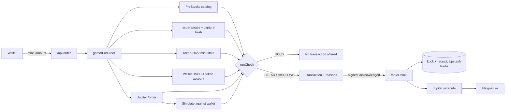

<div align="center">

# Preflight

**Check the token before you sign.**

A pre-trade check for PreStocks pre-IPO tokens on Solana mainnet. It sits between the Jupiter quote and your signature, and holds the buy when the PreStocks catalog, the issuer's published terms or the mint itself say stop.

[](#tests)
[](https://prestocks.com)
[](https://dev.jup.ag)
[](https://solscan.io/tx/XRSbAUw22ZtxEJRzkYzg5CsA4Y2zk68BezwQMYwJ83DgJP3qpnsczfmNa7AFrFFVdDRGGKFwejTxKDPrft1jcxq)
[](https://nextjs.org)
[](LICENSE)

[Live app](https://preflight-weld.vercel.app/app) · [Judge it in 90 seconds](#verify-it-yourself) · [Mainnet receipt](https://preflight-weld.vercel.app/r/XRSbAUw22ZtxEJRzkYzg5CsA4Y2zk68BezwQMYwJ83DgJP3qpnsczfmNa7AFrFFVdDRGGKFwejTxKDPrft1jcxq)

</div>

---

## Contents

- [The problem](#the-problem)
- [How it works](#how-it-works)
- [Verify it yourself](#verify-it-yourself)
- [Mainnet proof](#mainnet-proof)
- [What it checks](#what-it-checks)
- [Built on PreStocks and Jupiter](#built-on-prestocks-and-jupiter)
- [What it does for PreStocks](#what-it-does-for-prestocks)
- [Architecture](#architecture)
- [Engineering decisions](#engineering-decisions)
- [What it does not do](#what-it-does-not-do)
- [Run it locally](#run-it-locally)
- [Tests](#tests)

## The problem

I started with the XAI token. The PreStocks page says each XAI token had to be swapped into SpaceX before 23:59 UTC on 12 September 2026, or it would **expire worthless**. That window has closed, but the token still trades. On 24 September, twelve days after the deadline, Jupiter still routed USDC into XAI through Meteora pools holding over $280,000, and the XAI/USDC pool had recorded a buy in the previous 24 hours. Nothing in the mint account or a swap quote carries that deadline. It lives on a web page.

Then OPENAI. PreStocks publishes its own mark for every token. On 24 September its catalog listed OPENAI **32.8% above that mark**. A swap UI shows the price you will pay. It does not show the issuer's reference price next to it.

These tokens also carry things a normal SPL swap never meets. They are Token-2022 mints with a 1% transfer fee, a display multiplier (OPENAI's on-chain amount is multiplied by about 1.486 for display, so one OPENAI on screen is about 0.673 raw tokens) and a pause switch. The issuer publishes conversion deadlines on web pages, not on chain.

Every fact Preflight needs is public, but it is spread across four places: the PreStocks catalog, the issuer's web pages, the mint account and the Jupiter route. Preflight reads all four when you check a token and again when you prepare an order, from short caches (30 seconds for the catalog, 5 minutes for issuer pages). It will not hand you a transaction while the catalog, the mint, the route or a reviewed issuer deadline says stop. For tokens without a reviewed deadline, the issuer-page scan is advisory: a new notice is disclosed, and an unreadable page is reported as not checked rather than blocking the buy.

The same checks are what make buying the current catalog trustworthy. You get the exact mint PreStocks lists, the issuer's mark next to your real fill, and the issuer's reviewed deadline where one exists, all before you sign. Then a receipt shows what you actually paid.

## How it works

1. **Check.** Pick a token. Preflight reads the PreStocks catalog, the mint's Token-2022 state and, for tokens with a published deadline, the issuer's page. Then it returns `CLEAR`, `DISCLOSE` or `HOLD`, with a reason for each finding.
2. **Quote and simulate.** When you connect a wallet and enter an amount, Preflight takes a Jupiter Swap V2 order and simulates it against your wallet, watching your SOL, your USDC account and your token account. The simulation must debit exactly the USDC you asked for and credit tokens. Preflight prices both the expected fill and the minimum Jupiter reports for the route.
3. **Acknowledge.** A `DISCLOSE` finding has to be acknowledged, one toggle per reason, before signing. A `HOLD` never produces a transaction to sign.
4. **Sign.** Preflight derives the signature before it broadcasts and takes a lock on the order, so a retry cannot buy twice. It records the verdict, then sends the transaction through Jupiter.
5. **Receipt.** Every purchase gets a page at `/r/<signature>`. What the chain proves, what Preflight recorded and what the issuer published are shown as separate groups.

## Verify it yourself

Everything below runs against production, and you don't need a wallet. The responses are JSON; the blocks below are abridged.

**A token whose conversion window has closed is held.**

```bash
curl -s "https://preflight-weld.vercel.app/api/check?mint=PreC1KtJ1sBPPqaeeqL6Qb15GTLCYVvyYEwxhdfTwfx"
```

```text
status: HOLD   signAvailable: false
ISSUER_WINDOW_CLOSED   The issuer-defined XAI conversion window closed on 12 Sep 2026, 23:59 UTC.
NOT_IN_CURRENT_CATALOG This mint is not in the current PreStocks catalog.
```

Jupiter's public quote API will still route a buy into the same mint:

```bash
curl -s "https://lite-api.jup.ag/swap/v1/quote?inputMint=EPjFWdd5AufqSSqeM2qN1xzybapC8G4wEGGkZwyTDt1v&outputMint=PreC1KtJ1sBPPqaeeqL6Qb15GTLCYVvyYEwxhdfTwfx&amount=1000000"
# a route through Meteora DLMM, archived 25 Sep 2026, 00:09 UTC
```

A timestamped response is archived in [`proof/2026-09-25_xai_jupiter_quote.json`](proof/2026-09-25_xai_jupiter_quote.json), in case the route has changed by the time you run it.

**A token listed far above the issuer's mark is disclosed.**

```bash
curl -s "https://preflight-weld.vercel.app/api/check?mint=PreweJYECqtQwBtpxHL171nL2K6umo692gTm7Q3rpgF"
```

```text
status: DISCLOSE
ABOVE_MARK  PreStocks lists this token at $1,358.20, 32.8% above its own mark of $1,023.12 (policy threshold 5%).
```

These figures are from 24 September. The check reads live prices, so they move with the market. A preview without a wallet lists the route, simulation and account checks it could not run yet under `notEvaluated`, and does not report them as passed. The USDC balance check needs a wallet, so it runs only when you prepare an order.

**A token that borrows the OPENAI ticker is held.** Jupiter lists a tradable token whose symbol is exactly `OPENAI`, and PreStocks did not issue it. Preflight accepts only the exact mint in the PreStocks catalog, so a matching ticker is not enough.

```bash
curl -s "https://preflight-weld.vercel.app/api/check?mint=BQ7joNtLvoWPsf3XbAy6bvcNadBvPgkH6ESD7SSypump"
# status: HOLD  NOT_IN_CURRENT_CATALOG
```

**The replaced OPENAI mint is paused on chain.**

```bash
curl -s "https://preflight-weld.vercel.app/api/check?mint=PreYKD2kJ5xGgoZ644VPfbEN7sW8bWCUREHr5S3ebV9"
# status: HOLD  MINT_PAUSED, NOT_IN_CURRENT_CATALOG
```

**The verdict on a real purchase matches the hash recorded when the order was prepared.** The hash is SHA-256 over the verdict object, serialized with sorted keys. You can recompute it:

```bash
curl -s https://preflight-weld.vercel.app/api/receipt/XRSbAUw22ZtxEJRzkYzg5CsA4Y2zk68BezwQMYwJ83DgJP3qpnsczfmNa7AFrFFVdDRGGKFwejTxKDPrft1jcxq > r.json
node -e 'const r=require("./r.json");const s=v=>Array.isArray(v)?"["+v.map(s)+"]":v&&typeof v=="object"?"{"+Object.keys(v).sort().map(k=>JSON.stringify(k)+":"+s(v[k]))+"}":JSON.stringify(v);console.log(require("crypto").createHash("sha256").update(s(r.appRecorded.verdict)).digest("hex")===r.appRecorded.verdictHash)'
# true
```

Preflight publishes this hash itself and it is not anchored on chain. It shows the receipt is internally consistent and lets you detect edits against a copy you saved. It does not prove the record was never edited.

**The issuer evidence is the file in this repo.**

```bash
shasum -a 256 src/data/captures/2026-09-23_xai.html
# e89091221dc90dfd8027070831866cde721eb058edbf441dd2d4a0cba463462b, the sha256 recorded in src/data/lifecycle.json
```

## Mainnet proof

This is the purchase in the demo video, made on 25 September 2026 through the deployed app at preflight-weld.vercel.app, with a real wallet:

| | |
|---|---|
| Transaction | [`XRSbAUw2…Prft1jcxq`](https://solscan.io/tx/XRSbAUw22ZtxEJRzkYzg5CsA4Y2zk68BezwQMYwJ83DgJP3qpnsczfmNa7AFrFFVdDRGGKFwejTxKDPrft1jcxq), slot 450,330,796, finalized |
| Order | 1 USDC into SPACEX through Jupiter (Metis route, Meteora SPACEX-USDC pool) |
| Verdict at signing | `DISCLOSE` · `ISSUER_DEADLINE` (the issuer's 12 March 2027 conversion deadline) |
| Acknowledged | `ISSUER_DEADLINE`, toggled in the app, required by the server and recorded before broadcast (client-reported, not signed by the wallet) |
| Credited on chain | 0.00835368 SPACEX, exactly the expected amount and above the 0.00818661 minimum Jupiter reported for the route |
| Price paid | $119.71 per token, 19.9% below the issuer mark of $149.37. Of the 1 USDC, 0.001 went to Jupiter's fee account and 0.999 to the pool; the price includes it. |
| Wallet SOL spent | 0.000005472 SOL network fee. The wallet already had a SPACEX token account, so no rent. |
| Receipt | [preflight-weld.vercel.app/r/XRSbAUw2…Prft1jcxq](https://preflight-weld.vercel.app/r/XRSbAUw22ZtxEJRzkYzg5CsA4Y2zk68BezwQMYwJ83DgJP3qpnsczfmNa7AFrFFVdDRGGKFwejTxKDPrft1jcxq) |

The first route prepared for this purchase expired before it could be sent, and nothing was sent. A newly prepared order was then signed, and that is the transaction above.

To check it on the explorer, read the balance changes: 1 USDC out of the wallet and 0.00835368 SPACEX in. 1 ÷ 0.00835368 = $119.71 per token. Work the price out from these raw balance changes rather than from an explorer's dollar label. The receipt JSON and the prepared order are archived in [`proof/`](proof).

**The first deployed-app purchase**, on 24 September, is [`3mgVKNBX…HvVSDprT`](https://preflight-weld.vercel.app/r/3mgVKNBXReMXYzqAgwDcG2rTscGPct6o5cwCERb9jzj7p7BHmoWMvzxgaNMoWkN6LcT5RJ9UqcCfqvGUHvVSDprT) (slot 450,101,221): 1 USDC into 0.00846303 SPACEX through a DFlow route, exactly the expected credit, with `ISSUER_DEADLINE` and `HIGH_NETWORK_COST` acknowledged. It spent 0.001621 SOL rent opening the wallet's SPACEX token account. Its route passed through an XAI pool as an intermediate hop inside the same transaction; the wallet never held XAI. An order prepared under a minute before it expired while the wallet was still asking for approval, and the server refused its signature as too close to the 12-block safety margin, so nothing was sent.

**Earlier purchase.** The first mainnet buy, [`5XcWu1fa…jwPqwXPV`](https://preflight-weld.vercel.app/r/5XcWu1fa7tvQqDHuVynJ4rNbpnFBHgtTHHhz1wXnim1C3xvVfoBjVYLVKJNu8HQsgtiWrSurLPZWeUcrjwPqwXPV), was 2 USDC into ANTHROPIC through Preflight running locally, before the Vercel deploy. Its receipt record was copied into production storage, and it predates acknowledgement logging. One attempt before it expired because its signing window came from a fixed timer rather than the chain. That failure led to the chain-derived signing window described under [Engineering decisions](#engineering-decisions).

## What it checks

Fourteen reasons in two severities. `HOLD` means no transaction is offered. `DISCLOSE` means you can sign after acknowledging it.

| Code | Severity | Fires when |
|---|---|---|
| `ISSUER_WINDOW_CLOSED` | HOLD | The issuer's conversion deadline for this token has passed |
| `NOT_IN_CURRENT_CATALOG` | HOLD | The mint is not in the live PreStocks catalog |
| `MINT_PAUSED` | HOLD | The mint's Token-2022 pause flag is on |
| `DEST_ACCOUNT_FROZEN` | HOLD | Your token account for this mint is frozen |
| `INSUFFICIENT_USDC` | HOLD | Your wallet cannot cover the order |
| `NO_EXECUTABLE_ROUTE` | HOLD | Jupiter returns no route for this token at this size |
| `SIMULATION_FAILED` | HOLD | The simulated transaction fails, does not debit exactly the requested USDC, or credits no tokens |
| `SOURCE_UNAVAILABLE` | HOLD | A required source cannot be read |
| `EVIDENCE_CONFLICT` | HOLD | The live issuer page no longer links the mint or no longer carries the reviewed terms, or the bundled capture no longer matches its hash, or the catalog lists that token's symbol under a different mint |
| `ISSUER_DEADLINE` | DISCLOSE | The issuer has published a future conversion deadline (SPACEX: 12 Mar 2027) |
| `ISSUER_NOTICE` | DISCLOSE | The token's PreStocks page carries a lifecycle notice (a swap, expiry, conversion, redemption, halt or delisting) that does not exactly match a notice on the reviewed, hashed capture. Each notice is quoted in the issuer's words. If the page cannot be read, or does not link the token's own mint, notices are reported as not checked. |
| `ABOVE_MARK` | DISCLOSE | More than 5% above the issuer mark. A preview compares the listed price. An order compares the expected fill and the worst fill the transaction allows. |
| `THIN_ROUTE` | DISCLOSE | Your size moves the price more than 3% compared with a $1 quote on the same router |
| `HIGH_NETWORK_COST` | DISCLOSE | Fees and rent exceed 50,000 lamports or 0.5% of the order. The cost is also disclosed when SOL cannot be priced. |

A check that could not run is listed under `notEvaluated`. It never counts as a pass.

## Built on PreStocks and Jupiter

| Source | What Preflight takes from it | Call site |
|---|---|---|
| PreStocks catalog API | Listing, issuer mark, listed price, valuations | [`src/lib/catalog.ts`](src/lib/catalog.ts) `fetchCatalog` |
| PreStocks issuer pages | Conversion deadlines and terms, read from visible text and anchor links only | [`src/lib/issuer.ts`](src/lib/issuer.ts) `verifyIssuerEvidence` |
| Token-2022 mint accounts | Pause state, transfer fee, scaled-UI multiplier schedule | [`src/lib/mintState.ts`](src/lib/mintState.ts) `readMintState` |
| Jupiter Swap V2 `/order` | The route, expected output, the route's reported minimum, router | [`src/lib/jupiter.ts`](src/lib/jupiter.ts) `metaOrder` |
| Jupiter Swap V2 `/execute` | Broadcast of the signed transaction | [`src/lib/jupiter.ts`](src/lib/jupiter.ts) `metaExecute` |
| Solana RPC simulation | Exact USDC debit and token credit for your wallet | [`src/lib/solana.ts`](src/lib/solana.ts) `simulate` |
| GeckoTerminal | Live prices, pool flow and charts in the UI. The verdict never uses it. | [`src/lib/market.ts`](src/lib/market.ts) |

**Remove any one of the gate's sources and Preflight breaks.** GeckoTerminal is the exception, because it only feeds the UI. Without the catalog there is no mark to price against. Without the issuer pages, a SPACEX buyer gets no warning about the March 2027 deadline, and the XAI hold loses its reason. Without the mint state, a paused token or a raw-unit price slips through. Without Jupiter's order there is no fill to judge and no transaction to sign.

## What it does for PreStocks

- **Buyers reach the exact catalog mint.** On 22 September we counted about 40 impostor "Anthropic PreStocks" and "SpaceX PreStocks" mints on Solana. Preflight accepts only the mint in the live PreStocks catalog, so a lookalike never gets an order.
- **The issuer's terms reach the buyer at the moment of purchase.** PreStocks publishes deadlines and lockups on its token pages. Preflight quotes them in PreStocks' own words, with the page link and a capture hash, next to the price. A swap UI shows nothing there.
- **A premium is shown against PreStocks' own mark.** `ABOVE_MARK` is a disclosure, not a hold. The buyer still buys, after seeing the issuer's reference price.
- **Any wallet, bot or front end can run the same check.** `GET /api/check?mint=…` returns the verdict and its reasons as JSON, with no wallet and no key, rate-limited per IP. A PreStocks buy flow anywhere could call it before building a transaction.

## Architecture



`runCheck` in [`src/lib/check.ts`](src/lib/check.ts) is a pure function from evidence to verdict. All I/O happens in [`src/lib/gather.ts`](src/lib/gather.ts), so every reason code can be tested on fixed inputs.

## Engineering decisions

- **The worst fill is priced, not only the expected one.** A swap can fill anywhere down to the minimum Jupiter reports for the route, so `ABOVE_MARK` is checked against both prices.
- **The signing window comes from the chain.** The order expires 12 blocks before the transaction's `lastValidBlockHeight`, and `/api/submit` checks the block height again before broadcasting. The first mainnet attempt expired on a fixed timer. This reduces that risk but cannot remove it, because blocks keep arriving between the last check and Jupiter's broadcast.
- **The signature is recorded before broadcast.** Preflight takes the signature from the signed bytes, checks that the fee payer at index 0 signed the exact message it issued, writes the receipt record, then takes an atomic lock, all before calling Jupiter. A lock therefore never exists without a receipt. A lost response can show "outcome unknown", but a retry can't send the same order again, and a failed receipt write leaves nothing sent and the order retryable.
- **The simulation has to debit what you asked.** A route counts only if the simulation debits exactly the requested USDC and credits more than zero tokens. Preflight takes Jupiter's reported minimum (`otherAmountThreshold`) as the worst case. It has not independently decoded how every third-party router, such as DFlow, enforces that floor on chain. When the first route costs too much in fees and rent, Preflight re-quotes up to three times and keeps the cheapest one that passes.
- **Slippage has a floor above the transfer fee.** In our measurement, a 1% Token-2022 fee under 1% slippage failed 2 of 3 simulations. The floor is the fee plus 100 bps.
- **Prices are scaled per unit.** On-chain prices are per raw unit, and display prices are per scaled unit. Every comparison uses the multiplier active at that moment.
- **Issuer evidence has to be visible.** A mint only counts if it appears in an anchor link. A statement only counts if it survives the removal of comments, scripts, styles, templates and elements with the `hidden` attribute. This is a regex pass, not a DOM. Markup nested inside a `hidden` element, and text a stylesheet hides, can still count.

## What it does not do

| Claim | Status |
|---|---|
| Holds buys the issuer's published terms rule out | **Real, for tokens in the registry.** [`src/data/lifecycle.json`](src/data/lifecycle.json) records the issuer's published deadlines, currently XAI and SPACEX. Each check re-reads the live page (cached up to 5 minutes) and verifies the capture hash. Every other listed token has its PreStocks page read for new lifecycle notices, and one that is not in the registry is disclosed as `ISSUER_NOTICE` in the issuer's words until it is reviewed. On 24 September all nine token pages were checked, and only XAI and SPACEX carried a notice. |
| Prices your fill against the issuer mark | **Real.** The expected fill comes from Jupiter's quote and the worst case from the minimum Jupiter reports for the route. The simulation confirms the exact USDC debit and a positive token credit. |
| One order cannot execute twice | **Real.** Atomic lock (Redis `SET NX` in production). Tested with parallel submissions against the file store. |
| Verdict stored on chain | **No.** Preflight submits Jupiter's prepared message unchanged, and its exact-message check rejects any addition, so there is no memo. The verdict is stored by Preflight. Its hash detects edits if you saved the JSON, but it is not anchored on chain. |
| Mark freshness | **Partial.** PreStocks does not timestamp its mark. Preflight records when it read the catalog. |
| Eligibility | **Not decided.** Preflight shows the issuer's eligibility terms. It does not check your jurisdiction. |
| `THIN_ROUTE` on every order | **Partial.** When no $1 quote on the same router is available, it is reported as not evaluated. |
| Order size | **Capped at $5 on the server.** This runs on mainnet with real money. |
| Public API | **Rate-limited per IP**: per minute, 60 checks, 10 orders, 20 submissions and 60 receipt lookups. The limit protects paid RPC and Jupiter quota, so it fails open within half a second if Redis is slow or down. |
| Acknowledgements recorded | **Real.** The production receipt records `HIGH_NETWORK_COST` and `ISSUER_DEADLINE`. The earlier local purchase predates acknowledgement logging, and its receipt says so. |

## Run it locally

```bash
npm install
npm run dev
```

Put these in `.env.local`:

| Variable | Required | Purpose |
|---|---|---|
| `JUPITER_API_KEY` | yes | Jupiter Swap V2 |
| `SOLANA_RPC_URL` | yes | Mainnet RPC for mint state and simulation |
| `KV_REST_API_URL`, `KV_REST_API_TOKEN` | on Vercel | Upstash Redis for orders, locks, receipts and rate limits. Locally, without them, records go to `.data/` on disk and nothing is rate-limited. On Vercel the app refuses to start a store without them. |

## Tests

```bash
npm test
```

138 tests in 9 files cover:

- every reason path, with boundary tests for the three numeric policies
- the worst-case price policy
- Token-2022 fee and multiplier math, including scheduled changes
- issuer-page spoofing (mints only in comments or scripts, statements only in `hidden` elements, a one-character capture edit)
- partial catalog failures
- the slippage floor and same-router size impact
- submit races, lost responses, expiry and message tampering, and that Jupiter receives exactly the verified bytes
- a failed receipt write sending nothing and leaving the order retryable
- order input errors kept apart from internal failures
- reading whole lifecycle banners from issuer pages, and disclosing any that differ from the reviewed capture, including an amendment to a reviewed banner
- recomputing the verdict hash from stored JSON
- the per-IP rate limit, and refusing file storage on Vercel

---

<div align="center">

Built by **cassxbt** for **Stocklana** (Solana Foundation) · Main track and PreStocks track · [MIT](LICENSE)

</div>
