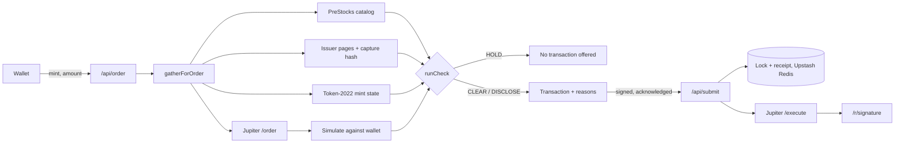

<div align="center">

# Preflight

**Check the token before you sign.**

A pre-trade check for PreStocks pre-IPO tokens on Solana mainnet. It sits between the Jupiter quote and your signature, and holds any buy the issuer's own evidence says you should not make.

[](#tests)
[](https://prestocks.com)
[](https://dev.jup.ag)
[](https://solscan.io/tx/5XcWu1fa7tvQqDHuVynJ4rNbpnFBHgtTHHhz1wXnim1C3xvVfoBjVYLVKJNu8HQsgtiWrSurLPZWeUcrjwPqwXPV)
[](https://nextjs.org)

[Live app](https://preflight-weld.vercel.app/app) · [Judge it in 90 seconds](#verify-it-yourself) · [Mainnet receipt](https://preflight-weld.vercel.app/r/5XcWu1fa7tvQqDHuVynJ4rNbpnFBHgtTHHhz1wXnim1C3xvVfoBjVYLVKJNu8HQsgtiWrSurLPZWeUcrjwPqwXPV)

</div>

---

## Contents

- [The problem](#the-problem)
- [How it works](#how-it-works)
- [Verify it yourself](#verify-it-yourself)
- [Mainnet proof](#mainnet-proof)
- [What it checks](#what-it-checks)
- [Built on PreStocks and Jupiter](#built-on-prestocks-and-jupiter)
- [Architecture](#architecture)
- [Engineering decisions](#engineering-decisions)
- [What it does not do](#what-it-does-not-do)
- [Run it locally](#run-it-locally)
- [Tests](#tests)

## The problem

I started with the XAI token. The PreStocks page says each XAI token had to be swapped into SpaceX before 23:59 UTC on 12 September 2026, or it would **expire worthless**. That window has closed, but the mint still exists on chain. Nothing in the mint account or a swap quote carries that deadline. It lives on a web page.

Then OPENAI. PreStocks publishes its own mark for every token. At the time of writing, its catalog lists OPENAI **32.8% above that mark**. A swap UI shows the price you will pay. It does not show the issuer's reference price next to it.

These tokens also carry things a normal SPL swap never meets. They are Token-2022 mints with a 1% transfer fee, a display multiplier (one OPENAI on screen is about 1.486 raw units) and a pause switch. The issuer publishes conversion deadlines on web pages, not on chain.

Every fact Preflight needs is public, but it is spread across four places: the PreStocks catalog, the issuer's web pages, the mint account and the Jupiter route. Preflight reads all four in the moment before you sign. It will not hand you a transaction to sign while any of them says stop.

The same checks are what make buying the current catalog trustworthy. You get the exact mint PreStocks lists, the issuer's mark next to your real fill, and the issuer's terms, all before you sign. Then a receipt shows what you actually paid.

## How it works

1. **Check.** Pick a token. Preflight reads the PreStocks catalog, the mint's Token-2022 state and the issuer's lifecycle page, then returns `CLEAR`, `DISCLOSE` or `HOLD`, with a reason for each finding.
2. **Quote and simulate.** When you connect a wallet and enter an amount, Preflight takes a Jupiter Swap V2 order and simulates it against your wallet. The simulation must debit exactly what you asked for and credit tokens. Preflight prices both the expected fill and the worst fill the transaction allows.
3. **Acknowledge.** A `DISCLOSE` finding has to be acknowledged, one toggle per reason, before signing. A `HOLD` never produces a transaction to sign.
4. **Sign.** Preflight derives the signature before it broadcasts and takes a lock on the order, so a retry cannot buy twice. It records the verdict, then sends the transaction through Jupiter.
5. **Receipt.** Every purchase gets a page at `/r/<signature>`. What the chain proves, what Preflight recorded and what the issuer published are shown as separate groups.

## Verify it yourself

Everything below runs against production. You don't need a wallet.

**A token whose conversion window has closed is held.**

```bash
curl -s "https://preflight-weld.vercel.app/api/check?mint=PreC1KtJ1sBPPqaeeqL6Qb15GTLCYVvyYEwxhdfTwfx"
```

```text
status: HOLD   signAvailable: false
ISSUER_WINDOW_CLOSED   The issuer-defined XAI conversion window closed on 12 Sep 2026, 23:59 UTC.
NOT_IN_CURRENT_CATALOG This mint is not in the current PreStocks catalog.
```

**A token listed far above the issuer's mark is disclosed.**

```bash
curl -s "https://preflight-weld.vercel.app/api/check?mint=PreweJYECqtQwBtpxHL171nL2K6umo692gTm7Q3rpgF"
```

```text
status: DISCLOSE
ABOVE_MARK  PreStocks lists this token at $1,358.20, 32.8% above its own mark of $1,023.12 (policy threshold 5%).
```

These are live figures, so the numbers move with the market. A preview without a wallet also lists the checks it could not run yet (route, simulation, account state) under `notEvaluated`. It does not report them as passed.

**The retired OPENAI mint is paused on chain.**

```bash
curl -s "https://preflight-weld.vercel.app/api/check?mint=PreYKD2kJ5xGgoZ644VPfbEN7sW8bWCUREHr5S3ebV9"
# status: HOLD  MINT_PAUSED, NOT_IN_CURRENT_CATALOG
```

**The verdict on a real purchase matches the hash recorded when the order was prepared.** The hash is SHA-256 over the verdict object, serialized with sorted keys. You can recompute it:

```bash
curl -s https://preflight-weld.vercel.app/api/receipt/5XcWu1fa7tvQqDHuVynJ4rNbpnFBHgtTHHhz1wXnim1C3xvVfoBjVYLVKJNu8HQsgtiWrSurLPZWeUcrjwPqwXPV > r.json
node -e 'const r=require("./r.json");const s=v=>Array.isArray(v)?"["+v.map(s)+"]":v&&typeof v=="object"?"{"+Object.keys(v).sort().map(k=>JSON.stringify(k)+":"+s(v[k]))+"}":JSON.stringify(v);console.log(require("crypto").createHash("sha256").update(s(r.appRecorded.verdict)).digest("hex")===r.appRecorded.verdictHash)'
# true
```

Preflight publishes this hash itself and it is not anchored on chain. It shows the receipt is internally consistent and lets you detect edits against a copy you saved. It does not prove the record was never edited.

**The issuer evidence is the file in this repo.**

```bash
shasum -a 256 src/data/captures/2026-09-23_xai.html
# e89091221dc90dfd8027070831866cde721eb058edbf441dd2d4a0cba463462b, the sha256 recorded in src/data/lifecycle.json
```

## Mainnet proof

This purchase was made through the deployed app with a real wallet:

| | |
|---|---|
| Transaction | [`5XcWu1fa…jwPqwXPV`](https://solscan.io/tx/5XcWu1fa7tvQqDHuVynJ4rNbpnFBHgtTHHhz1wXnim1C3xvVfoBjVYLVKJNu8HQsgtiWrSurLPZWeUcrjwPqwXPV), slot 449,898,611 |
| Order | 2 USDC into ANTHROPIC through Jupiter (Metis route) |
| Verdict at signing | `DISCLOSE` · `HIGH_NETWORK_COST`: 0.001522 SOL, 8.8% of a $2 order. Only 0.000034 SOL was the network fee. The other 0.001488 SOL was rent for an empty JUP token account that the Metis route opened in the wallet, and it comes back if that account is closed. |
| Expected credit | 0.001899039 ANTHROPIC |
| Credited on chain | 0.001897345 ANTHROPIC, 0.09% below expected and above the guaranteed minimum of 0.001861059 |
| Price paid | $1,054.10 per token, 1.49% above the issuer mark of $1,038.61 |
| Receipt | [preflight-weld.vercel.app/r/5XcWu1fa…](https://preflight-weld.vercel.app/r/5XcWu1fa7tvQqDHuVynJ4rNbpnFBHgtTHHhz1wXnim1C3xvVfoBjVYLVKJNu8HQsgtiWrSurLPZWeUcrjwPqwXPV) |

An earlier attempt expired before it landed. Its signing window came from a fixed timer rather than the chain. That failure led to the chain-derived signing window described under [Engineering decisions](#engineering-decisions).

## What it checks

Thirteen reasons in two severities. `HOLD` means no transaction is offered. `DISCLOSE` means you can sign after acknowledging it.

| Code | Severity | Fires when |
|---|---|---|
| `ISSUER_WINDOW_CLOSED` | HOLD | The issuer's conversion deadline for this token has passed |
| `NOT_IN_CURRENT_CATALOG` | HOLD | The mint is not in the live PreStocks catalog |
| `MINT_PAUSED` | HOLD | The Token-2022 pausable extension is set |
| `DEST_ACCOUNT_FROZEN` | HOLD | Your token account for this mint is frozen |
| `INSUFFICIENT_USDC` | HOLD | Your wallet cannot cover the order |
| `NO_EXECUTABLE_ROUTE` | HOLD | Jupiter returns no route for this token at this size |
| `SIMULATION_FAILED` | HOLD | The simulated transaction fails, or does not debit and credit what was quoted |
| `SOURCE_UNAVAILABLE` | HOLD | A required source cannot be read, or issuer evidence is older than 24 hours |
| `EVIDENCE_CONFLICT` | HOLD | The live issuer page no longer links the mint or no longer carries the reviewed terms, or the bundled capture no longer matches its hash |
| `ISSUER_DEADLINE` | DISCLOSE | The issuer has published a future conversion deadline (SPACEX: 12 Mar 2027) |
| `ABOVE_MARK` | DISCLOSE | The expected fill, or the worst fill the transaction allows, is more than 5% above the issuer mark |
| `THIN_ROUTE` | DISCLOSE | Your size moves the price more than 3% compared with a $1 quote on the same router |
| `HIGH_NETWORK_COST` | DISCLOSE | Fees and rent exceed 50,000 lamports or 0.5% of the order. The cost is also disclosed when SOL cannot be priced. |

A check that could not run is listed under `notEvaluated`. It never counts as a pass.

## Built on PreStocks and Jupiter

| Source | What Preflight takes from it | Call site |
|---|---|---|
| PreStocks catalog API | Listing, issuer mark, listed price, valuations | [`src/lib/catalog.ts`](src/lib/catalog.ts) `fetchCatalog` |
| PreStocks issuer pages | Conversion deadlines and terms, read from visible text and anchor links only | [`src/lib/issuer.ts`](src/lib/issuer.ts) `verifyIssuerEvidence` |
| Token-2022 mint accounts | Pause state, transfer fee, scaled-UI multiplier schedule | [`src/lib/mintState.ts`](src/lib/mintState.ts) `readMintState` |
| Jupiter Swap V2 `/order` | The route, expected output, guaranteed minimum, router | [`src/lib/jupiter.ts`](src/lib/jupiter.ts) `metaOrder` |
| Jupiter Swap V2 `/execute` | Broadcast of the signed transaction | [`src/lib/jupiter.ts`](src/lib/jupiter.ts) `metaExecute` |
| Solana RPC simulation | Exact USDC debit and token credit for your wallet | [`src/lib/solana.ts`](src/lib/solana.ts) `simulate` |
| GeckoTerminal | Live prices, pool flow and charts in the UI. The verdict never uses it. | [`src/lib/market.ts`](src/lib/market.ts) |

**Remove any one of the gate's sources and Preflight breaks.** GeckoTerminal is the exception, because it only feeds the UI. Without the catalog there is no mark to price against. Without the issuer pages, XAI looks buyable. Without the mint state, a paused token or a raw-unit price slips through. Without Jupiter's order there is no fill to judge and no transaction to sign.

## Architecture



`runCheck` in [`src/lib/check.ts`](src/lib/check.ts) is a pure function from evidence to verdict. All I/O happens in [`src/lib/gather.ts`](src/lib/gather.ts), so every reason code can be tested on fixed inputs.

## Engineering decisions

- **The worst fill is priced, not only the expected one.** The transaction guarantees only its minimum output, so `ABOVE_MARK` is checked against both prices.
- **The signing window comes from the chain.** The order expires 12 blocks before the transaction's `lastValidBlockHeight`, and `/api/submit` checks the block height again before broadcasting. The first mainnet attempt expired on a fixed timer. This reduces that risk but cannot remove it, because blocks keep arriving between the last check and Jupiter's broadcast.
- **The signature is recorded before broadcast.** Preflight takes the signature from the signed bytes, checks that the fee payer at index 0 signed the exact message it issued, takes an atomic lock and writes the receipt record before calling Jupiter. A lost response can show "outcome unknown", but a retry can't send the same order again.
- **The simulation has to debit what you asked.** A route counts only if the simulation debits exactly the requested USDC and credits more than zero tokens. The minimum output is enforced on chain by Jupiter's program, and Preflight prices it as the worst case. Preflight takes up to three quotes and keeps the cheapest one that passes.
- **Slippage has a floor above the transfer fee.** A 1% Token-2022 fee under 1% slippage fails every route. The floor is the fee plus 100 bps.
- **Prices are scaled per unit.** On-chain prices are per raw unit, and display prices are per scaled unit. Every comparison uses the multiplier active at that moment.
- **Issuer evidence has to be visible.** A mint only counts if it appears in an anchor link. A statement only counts if it survives the removal of comments, scripts, styles, templates and elements with the `hidden` attribute. Preflight does not render CSS, so text a stylesheet hides would still count.

## What it does not do

| Claim | Status |
|---|---|
| Holds buys the issuer's own evidence rules out | **Real.** Live issuer page plus a hashed capture, checked on every order |
| Prices your fill against the issuer mark | **Real.** Expected and worst-case, from a simulated Jupiter transaction |
| One order cannot execute twice | **Real.** Atomic lock in Upstash Redis. Tested with parallel submissions, and in production 1 of 10 concurrent claims won. |
| Verdict stored on chain | **No.** Preflight submits Jupiter's prepared message unchanged, and its exact-message check rejects any addition, so there is no memo. The verdict is stored by Preflight. Its hash detects edits if you saved the JSON, but it is not anchored on chain. |
| Mark freshness | **Partial.** PreStocks does not timestamp its mark. Preflight records when it read the catalog. |
| Eligibility | **Not decided.** Preflight shows the issuer's eligibility terms. It does not check your jurisdiction. |
| `THIN_ROUTE` on every order | **Partial.** When no $1 quote on the same router is available, it is reported as not evaluated. |
| Order size | **Capped at $5 on the server.** This runs on mainnet with real money. |
| Public API | **Rate-limited per IP**: 60 checks and 10 orders a minute. The limit protects paid RPC and Jupiter quota, so it fails open if Redis is down. |
| Acknowledgements on the first mainnet receipt | **Not recorded.** That purchase predates acknowledgement logging, and its receipt says so. |

## Run it locally

```bash
npm install
npm run dev
```

Put these in `.env.local`:

| Variable | Required | Purpose |
|---|---|---|
| `JUPITER_API_KEY` | yes | Jupiter Swap V2 |
| `SOLANA_RPC_URL` | yes | Mainnet RPC for mint state and simulation |
| `KV_REST_API_URL`, `KV_REST_API_TOKEN` | on Vercel | Upstash Redis for orders, locks, receipts and rate limits. Locally, without them, records go to `.data/` on disk and nothing is rate-limited. On Vercel the app refuses to start a store without them. |

## Tests

```bash
npm test
```

90 tests in 8 files cover:

- every reason path, with boundary tests for the three numeric policies
- the worst-case price policy
- Token-2022 fee and multiplier math, including scheduled changes
- issuer-page spoofing (mints only in comments or scripts, statements only in `hidden` elements, a one-character capture edit)
- partial catalog failures
- the slippage floor and same-router size impact
- submit races, lost responses, expiry and message tampering
- recomputing the verdict hash from stored JSON
- the per-IP rate limit, and refusing file storage on Vercel

---

<div align="center">

Built by **cassxbt** for **Stocklana** (Solana Foundation) · Main track and PreStocks track

</div>
